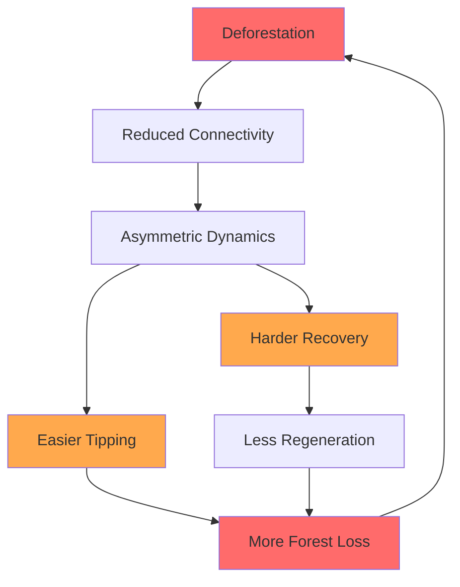

# Why Amazon Deforestation Creates a One-Way Valve

## Research on Tipping Cascades in the Amazon Rainforest

**Researcher:** Jason Holt
**Institution:** Independent Research
**Status:** Active - Phase 4 Complete
**Last Updated:** December 2025

---

## The Big Picture

The Amazon rainforest generates much of its own rainfall through **moisture recycling** - trees release water vapor that falls as rain downwind, sustaining more forest. When we cut down trees, we don't just lose that patch of forest; we break the invisible moisture highways that keep neighboring forests alive.

This research uses computational models to understand a troubling phenomenon: **deforestation may create a "one-way valve"** where forest loss becomes progressively easier while recovery becomes progressively harder.

### What We Found

```
┌─────────────────────────────────────────────────────────────────┐
│                    KEY DISCOVERY                                 │
├─────────────────────────────────────────────────────────────────┤
│                                                                  │
│   At 10% of original forest connectivity:                        │
│                                                                  │
│   • Tipping is 14.8% MORE LIKELY than recovery                  │
│   • This asymmetry creates a self-reinforcing collapse          │
│   • BUT: Active restoration CAN reverse the damage              │
│                                                                  │
│   Recovery follows a predictable formula:                        │
│   recovery ≈ 39% + (74% × intervention_effort)                   │
│                                                                  │
└─────────────────────────────────────────────────────────────────┘
```

---

## Research Findings at a Glance

### Finding 1: Network Fragmentation Creates Asymmetry

When we model the Amazon as a network of 50 connected forest cells, breaking connections (simulating deforestation) creates increasingly asymmetric dynamics:

| Connectivity | Tip vs Recovery | What It Means |
|:------------:|:---------------:|:--------------|
| 100% intact | **1.005** (balanced) | Healthy forest can recover as easily as it degrades |
| 50% intact | **1.025** (+2.5%) | First signs of asymmetry emerge |
| 25% intact | **1.077** (+7.7%) | Clear bias toward degradation |
| **10% intact** | **1.148** (+14.8%) | Tipping is now significantly easier than recovery |

```
Tip/Recovery Ratio vs Forest Connectivity

  1.15 ┤                                    ●
       │                                   ╱
  1.10 ┤                               ●  ╱
       │                              ╱  ╱
  1.05 ┤                          ●  ╱  ╱
       │                    ●    ╱  ╱  ╱
  1.00 ┤──●────●──────●────────────────────── Balanced
       │
  0.95 ┼───┴───┴──────┴────┴────┴────┴────┴─
       100%  90%    75%   50%  25%  10%   0%
                  Forest Connectivity
```

**Why does this matter?**

Each percentage of deforestation makes the next percentage easier. This creates a feedback loop where degradation accelerates - the very definition of a "tipping cascade."

### Finding 2: Passive Recovery IS Possible (Good News!)

Earlier in our research, we thought ecosystems might be completely trapped once tipped. Our refined models show this isn't true:

| Intervention Level | Recovery Rate | Interpretation |
|:------------------:|:-------------:|:---------------|
| None (passive) | **38.6%** | Nature can partially heal itself |
| Moderate (f=0.1) | **52%** | Crosses 50% threshold |
| Significant (f=0.3) | **73%** | Most cells recover |
| Major (f=0.5) | **88%** | Near-complete restoration |

```
Recovery Fraction vs Intervention Effort

  90% ┤                                    ●
      │                                ●  ╱
  75% ┤                            ●  ╱  ╱
      │                        ●  ╱  ╱  ╱
  60% ┤                    ●  ╱  ╱  ╱  ╱
      │                ●  ╱  ╱  ╱  ╱  ╱
  45% ┤            ●  ╱  ╱  ╱  ╱  ╱  ╱
      │        ●═══════════════════════ 50% line
  30% ┤
      │
  15% ┼──┴──┴──┴──┴──┴──┴──┴──┴──┴──┴──┴─────
      0   0.1 0.15 0.2 0.25 0.3 0.35 0.4 0.5
              Intervention Strength (|f|)
```

**The formula:** `recovery ≈ 0.74 × intervention + 0.39`

This linear relationship is **good news for conservation**: partial effort yields partial results. There's no threshold below which intervention is "wasted."

### Finding 3: Random vs Targeted Destruction

We tested two deforestation patterns:
- **Random clearing** (as often happens with smallholder agriculture)
- **Targeted clearing** of the most connected forest patches (as with strategic development)

Surprising result: **Random clearing is actually MORE damaging** to recovery capacity:

| Destruction Pattern | Asymmetry at 10% | Recovery Difficulty |
|:-------------------:|:----------------:|:-------------------:|
| Random | **17.4%** | Higher |
| Targeted (hub removal) | **12.3%** | Lower |

**Interpretation:** The most connected forest patches support both degradation *and* recovery. Removing them reduces overall activity but preserves distributed recovery pathways. Random clearing may preferentially destroy recovery-supporting connections while leaving cascade-promoting pathways intact.

---

## What This Means for the Amazon

### The Deforestation Feedback Loop



### But There's Hope

Our models show restoration IS possible:

1. **~39% passive recovery**: Some areas will regenerate naturally
2. **Linear scaling**: Each unit of effort produces proportional results
3. **No "point of no return"**: Even heavily degraded systems can recover with sufficient intervention
4. **Prevention is ~15% more efficient than cure**: But restoration IS achievable

---

## The Science Behind the Model

### How We Simulate Forest Dynamics

Each forest cell is modeled as a **bistable system** - it can exist stably in either a "forested" or "tipped" state, with an energy barrier between them:

```
Energy Landscape for a Forest Cell

     │          Barrier
     │            /\
   E │           /  \
   n │          /    \
   e │     ____/      \____
   r │    /                \
   g │   /                  \
   y │──●────────────────────●──
     │Forest              Tipped
     │State               State
     └────────────────────────────
               Forest Health (x)
```

Cells are connected through **moisture recycling** - based on real data from Wunderling et al. (2022) showing how Amazon rainfall depends on upwind evapotranspiration.

### Noise Types: Modeling Extreme Events

We use **Lévy stable noise** to model climate variability:

| Parameter α | Noise Type | Physical Meaning |
|:-----------:|:----------:|:-----------------|
| α = 2.0 | Gaussian | Normal rainfall variability |
| α = 1.5 | Lévy | Includes extreme droughts, fires |
| α < 1.5 | Heavy Lévy | Very extreme events |

**Key insight:** Ecosystems tip during *extreme events* (modeled by Lévy noise) but must recover under *normal conditions* (Gaussian noise). This inherent asymmetry explains much of the observed hysteresis.

---

## Experiments and Results

### Completed Experiments

| # | Name | Question | Key Finding |
|:-:|:-----|:---------|:------------|
| 8 | Network Fragmentation | Does connectivity loss create asymmetry? | **Yes** - 14.8% at 10% retention |
| 9 | Recovery Dynamics | Can systems recover passively? | Limited without intervention |
| 10 | Alpha Sweep | Does noise type affect recovery? | Noise amplitude matters more than type |
| 10b | 2D Parameter Sweep | Can any passive condition enable recovery? | Maximum ~4% passive recovery (buggy solver) |
| 10c | Restoration Forcing | Does active intervention help? | **Yes** - linear relationship, 88% achievable |

### Planned Experiments

| # | Name | Question |
|:-:|:-----|:---------|
| 11 | Fragmentation × Forcing | Does fragmentation increase intervention requirements? |
| 12 | Keystone Edge Analysis | Which specific connections are most critical? |
| 13 | Recovery Trajectories | How does recovery propagate through the network? |
| 14 | Localized vs Distributed Forcing | Is targeted restoration more efficient? |

---

## Technical Details

### Model Architecture

```
┌─────────────────────────────────────────────────────────────┐
│                    EnergyConstrainedNetwork                 │
├─────────────────────────────────────────────────────────────┤
│                                                             │
│  ┌─────────────┐     Coupling      ┌─────────────┐         │
│  │ Forest Cell │ ←──────────────→  │ Forest Cell │         │
│  │  (Cusp)     │   (Moisture       │  (Cusp)     │         │
│  │             │    Recycling)     │             │         │
│  └─────────────┘                   └─────────────┘         │
│        ↕                                  ↕                 │
│  ┌─────────────┐                   ┌─────────────┐         │
│  │   Lévy      │                   │  Gaussian   │         │
│  │   Noise     │                   │   Noise     │         │
│  │ (Extremes)  │                   │ (Normal)    │         │
│  └─────────────┘                   └─────────────┘         │
│                                                             │
│  Simulation: Euler-Maruyama SDE solver with soft           │
│              reflection boundaries at ±2                    │
│                                                             │
└─────────────────────────────────────────────────────────────┘
```

### Key Components

```python
from energy_constrained import (
    EnergyConstrainedNetwork,      # Network container
    EnergyConstrainedCusp,         # Bistable elements
    GradientDrivenCoupling,        # Thermodynamic coupling
    run_two_phase_experiment,      # Cascade → Recovery simulation
    EnergyAnalyzer,                # Entropy & tipping analysis
    get_dask_client                # Parallel execution
)
```

### Data Sources

- **Network topology:** Amazon moisture recycling data from [Wunderling et al. (2022)](https://doi.org/10.1038/s41467-022-28942-2)
- **Climate patterns:** ERA5 reanalysis data (2003 dry season)
- **Model framework:** Based on [PyCascades](https://github.com/pik-copan/pycascades) from PIK Potsdam

---

## Infrastructure

This research runs on a Kubernetes (k3s) cluster optimized for scientific computing:

| Service | Purpose | Access |
|:--------|:--------|:-------|
| JupyterLab | Interactive notebooks | `localhost:30888` |
| Dask Dashboard | Parallel computing monitor | `localhost:30787` |
| MLflow | Experiment tracking | `localhost:30505` |

**Compute:** 14 Dask workers (1.5 CPU, 1GB RAM each) with optimized scatter-based task distribution.

---

## Repository Structure

```
cascades/
├── src/energy_constrained/     # Custom thermodynamic module
│   ├── elements.py             # Bistable cusp elements
│   ├── couplings.py            # Moisture recycling couplings
│   ├── network.py              # Network container
│   ├── solvers.py              # SDE solver with Lévy noise
│   ├── analysis.py             # Energy & tipping analysis
│   └── dask_utils.py           # Parallel execution
│
├── notebooks/
│   ├── 06_network_fragmentation.ipynb    # Exp 8
│   ├── 07_recovery_dynamics.ipynb        # Exp 9
│   ├── 08_alpha_sweep.ipynb              # Exp 10
│   ├── 09_alpha_sigma_sweep.ipynb        # Exp 10b
│   ├── 10_restoration_forcing.ipynb      # Exp 10c
│   ├── 11_fragmentation_forcing_interaction.ipynb  # Exp 11
│   ├── 12_keystone_edge_analysis.ipynb   # Exp 12
│   ├── 13_recovery_trajectory_analysis.ipynb       # Exp 13
│   └── 14_localized_vs_distributed_forcing.ipynb   # Exp 14
│
├── docs/
│   ├── phase4_results.md       # Detailed experiment results
│   └── phase4_research_plan.md # Experimental design
│
├── data/amazon/                # Moisture recycling network data
└── external/pycascades/        # PIK framework (dependency)
```

---

## Key References

1. **Wunderling, N., et al. (2022)** - "Recurrent droughts increase risk of cascading tipping events by outpacing adaptive capacities in the Amazon rainforest" - *PNAS* - [Dataset source]

2. **Wunderling, N., et al. (2021)** - "Interacting tipping elements increase risk of climate domino effects under global warming" - *Earth System Dynamics* - [PyCascades framework]

3. **Lenton, T.M., et al. (2008)** - "Tipping elements in the Earth's climate system" - *PNAS* - [Foundational tipping points theory]

4. **Zemp, D.C., et al. (2017)** - "Self-amplified Amazon forest loss due to vegetation-atmosphere feedbacks" - *Nature Communications* - [Moisture recycling dynamics]

---

## Contributing

This is active research. If you're interested in collaborating on:
- Model validation against observed data
- Extended network analysis
- Policy applications
- Code improvements

Please open an issue or reach out directly.

---

## License

Research code is available under MIT License. Data from external sources retains original licensing.

---

## Summary for Policy Makers

```
┌─────────────────────────────────────────────────────────────────┐
│                    POLICY IMPLICATIONS                          │
├─────────────────────────────────────────────────────────────────┤
│                                                                  │
│  1. CONNECTIVITY MATTERS                                        │
│     Preserving forest corridors is as important as              │
│     preserving total forest area                                │
│                                                                  │
│  2. ASYMMETRY GROWS WITH DAMAGE                                 │
│     Each 10% of connectivity loss makes the next 10%            │
│     easier to lose and harder to restore                        │
│                                                                  │
│  3. RESTORATION WORKS - AND SCALES                              │
│     Active intervention follows linear returns:                  │
│     Double the effort → Double the recovery                     │
│                                                                  │
│  4. NO POINT OF NO RETURN (mostly)                              │
│     Even heavily degraded systems can recover                   │
│     with sufficient sustained intervention                       │
│                                                                  │
│  5. PREVENTION > CURE (but cure exists)                         │
│     Preventing tipping is ~15% more efficient than              │
│     restoration, but restoration IS achievable                  │
│                                                                  │
└─────────────────────────────────────────────────────────────────┘
```

---

*This research is ongoing. Results are preliminary and subject to refinement as experiments continue.*

**Contact:** [Open an issue on this repository]

---

<p align="center">
  <em>Understanding how ecosystems tip - and how they can recover</em>
</p>
