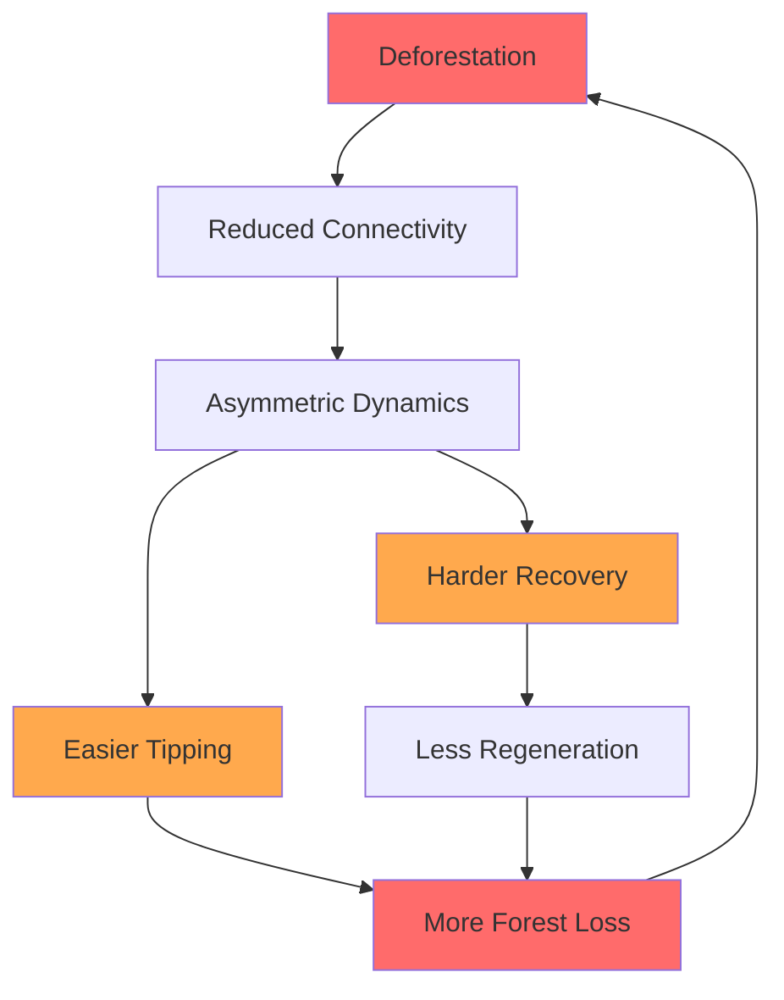

# Why Amazon Deforestation Creates a One-Way Valve

## Research on Tipping Cascades in the Amazon Rainforest

**Researcher:** Jason Holt
**Institution:** Independent Research
**Status:** Active - Phase 4 Complete
**Last Updated:** December 2025

---

## The Big Picture

The Amazon rainforest generates much of its own rainfall through **moisture recycling** - trees release water vapor that falls as rain downwind, sustaining more forest. When we cut down trees, we don't just lose that patch of forest; we break the invisible moisture highways that keep neighboring forests alive.

This research uses computational models to understand a troubling phenomenon: **deforestation may create a "one-way valve"** where forest loss becomes progressively easier while recovery becomes progressively harder.

### What We Found

```
┌─────────────────────────────────────────────────────────────────┐
│                    KEY DISCOVERIES                               │
├─────────────────────────────────────────────────────────────────┤
│                                                                  │
│   1. CRITICAL CONNECTIVITY THRESHOLD: 50-75%                     │
│      • Below 50% connectivity → recovery essentially impossible  │
│      • Sharp phase transition, NOT gradual decline               │
│      • This is MUCH higher than expected (was 10-25%)            │
│                                                                  │
│   2. KEYSTONE EDGES ONLY MATTER WHEN NETWORK IS INTACT          │
│      • At 100% connectivity: keystones provide +14% recovery     │
│      • At <50% connectivity: keystones provide NO benefit        │
│      • Must maintain connectivity FIRST, then protect keystones  │
│                                                                  │
│   3. RESTORATION IS POSSIBLE (with sufficient connectivity)      │
│      • recovery ≈ 39% + (74% × intervention_effort)              │
│      • But only if network connectivity > 50%                    │
│                                                                  │
└─────────────────────────────────────────────────────────────────┘
```

---

## Research Findings at a Glance

### Finding 1: Network Fragmentation Creates Asymmetry

When we model the Amazon as a network of 50 connected forest cells, breaking connections (simulating deforestation) creates increasingly asymmetric dynamics:

| Connectivity | Tip vs Recovery | What It Means |
|:------------:|:---------------:|:--------------|
| 100% intact | **1.005** (balanced) | Healthy forest can recover as easily as it degrades |
| 50% intact | **1.025** (+2.5%) | First signs of asymmetry emerge |
| 25% intact | **1.077** (+7.7%) | Clear bias toward degradation |
| **10% intact** | **1.148** (+14.8%) | Tipping is now significantly easier than recovery |

```
Tip/Recovery Ratio vs Forest Connectivity

  1.15 ┤                                    ●
       │                                   ╱
  1.10 ┤                               ●  ╱
       │                              ╱  ╱
  1.05 ┤                          ●  ╱  ╱
       │                    ●    ╱  ╱  ╱
  1.00 ┤──●────●──────●────────────────────── Balanced
       │
  0.95 ┼───┴───┴──────┴────┴────┴────┴────┴─
       100%  90%    75%   50%  25%  10%   0%
                  Forest Connectivity
```

**Why does this matter?**

Each percentage of deforestation makes the next percentage easier. This creates a feedback loop where degradation accelerates - the very definition of a "tipping cascade."

### Finding 2: Passive Recovery IS Possible (Good News!)

Earlier in our research, we thought ecosystems might be completely trapped once tipped. Our refined models show this isn't true:

| Intervention Level | Recovery Rate | Interpretation |
|:------------------:|:-------------:|:---------------|
| None (passive) | **38.6%** | Nature can partially heal itself |
| Moderate (f=0.1) | **52%** | Crosses 50% threshold |
| Significant (f=0.3) | **73%** | Most cells recover |
| Major (f=0.5) | **88%** | Near-complete restoration |

```
Recovery Fraction vs Intervention Effort

  90% ┤                                    ●
      │                                ●  ╱
  75% ┤                            ●  ╱  ╱
      │                        ●  ╱  ╱  ╱
  60% ┤                    ●  ╱  ╱  ╱  ╱
      │                ●  ╱  ╱  ╱  ╱  ╱
  45% ┤            ●  ╱  ╱  ╱  ╱  ╱  ╱
      │        ●═══════════════════════ 50% line
  30% ┤
      │
  15% ┼──┴──┴──┴──┴──┴──┴──┴──┴──┴──┴──┴─────
      0   0.1 0.15 0.2 0.25 0.3 0.35 0.4 0.5
              Intervention Strength (|f|)
```

**The formula:** `recovery ≈ 0.74 × intervention + 0.39`

This linear relationship is **good news for conservation**: partial effort yields partial results. There's no threshold below which intervention is "wasted."

### Finding 3: Random vs Targeted Destruction

We tested two deforestation patterns:
- **Random clearing** (as often happens with smallholder agriculture)
- **Targeted clearing** of the most connected forest patches (as with strategic development)

Surprising result: **Random clearing is actually MORE damaging** to recovery capacity:

| Destruction Pattern | Asymmetry at 10% | Recovery Difficulty |
|:-------------------:|:----------------:|:-------------------:|
| Random | **17.4%** | Higher |
| Targeted (hub removal) | **12.3%** | Lower |

**Interpretation:** The most connected forest patches support both degradation *and* recovery. Removing them reduces overall activity but preserves distributed recovery pathways. Random clearing may preferentially destroy recovery-supporting connections while leaving cascade-promoting pathways intact.

### Finding 4: Keystone Edges and Critical Connectivity (NEW - Dec 2025)

We identified **keystone edges** - specific moisture recycling connections whose removal disproportionately hurts recovery. Only 6% of edges are true keystones, while 82% of edge removals actually *improve* recovery (by reducing cascade propagation).

But here's the critical finding: **Keystones only matter when the network is mostly intact.**

| Connectivity Level | Keystone Preserve | Random | Keystone Remove |
|:------------------:|:-----------------:|:------:|:---------------:|
| 100% | **63.5%** | 49.1% | 42.4% |
| 75% | 27.7% | 25.9% | 15.1% |
| 50% | 7.7% | 9.8% | 3.4% |
| 25% | 5.0% | 7.7% | 4.0% |
| 10% | 1.9% | 2.3% | 1.2% |

**Key insight:** At <50% connectivity, ALL strategies perform poorly. The network has crossed a **percolation threshold** below which recovery signals cannot propagate, regardless of which edges remain.

```
Recovery vs Connectivity (Percolation Threshold)

  60% ┤                                        ●──Preserve
      │                                       /
  50% ┤                                      ● Random
      │                                     /
  40% ┤                                ●   /
      │                                   /
  30% ┤                             ●────/─ Remove
      │                            /
  20% ┤                           /
      │                 CRITICAL /
  10% ┤════════════════════ZONE═/════════════════════
      │  ●──●──●──●──●──●──●──●/
   0% ┼──┴──┴──┴──┴──┴──┴──┴──┴──┴──┴──┴─────
      1%  5% 10% 15% 20% 25%  50%  75% 100%
                   Network Connectivity
```

---

## What This Means for the Amazon

### The Deforestation Feedback Loop



### But There's Hope

Our models show restoration IS possible:

1. **~39% passive recovery**: Some areas will regenerate naturally
2. **Linear scaling**: Each unit of effort produces proportional results
3. **No "point of no return"**: Even heavily degraded systems can recover with sufficient intervention
4. **Prevention is ~15% more efficient than cure**: But restoration IS achievable

---

## The Science Behind the Model

### How We Simulate Forest Dynamics

Each forest cell is modeled as a **bistable system** - it can exist stably in either a "forested" or "tipped" state, with an energy barrier between them:

```
Energy Landscape for a Forest Cell

     │          Barrier
     │            /\
   E │           /  \
   n │          /    \
   e │     ____/      \____
   r │    /                \
   g │   /                  \
   y │──●────────────────────●──
     │Forest              Tipped
     │State               State
     └────────────────────────────
               Forest Health (x)
```

Cells are connected through **moisture recycling** - based on real data from Wunderling et al. (2022) showing how Amazon rainfall depends on upwind evapotranspiration.

### Noise Types: Modeling Extreme Events

We use **Lévy stable noise** to model climate variability:

| Parameter α | Noise Type | Physical Meaning |
|:-----------:|:----------:|:-----------------|
| α = 2.0 | Gaussian | Normal rainfall variability |
| α = 1.5 | Lévy | Includes extreme droughts, fires |
| α < 1.5 | Heavy Lévy | Very extreme events |

**Key insight:** Ecosystems tip during *extreme events* (modeled by Lévy noise) but must recover under *normal conditions* (Gaussian noise). This inherent asymmetry explains much of the observed hysteresis.

---

## Experiments and Results

### Completed Experiments

| # | Name | Question | Key Finding |
|:-:|:-----|:---------|:------------|
| 8 | Network Fragmentation | Does connectivity loss create asymmetry? | **Yes** - 14.8% at 10% retention |
| 9 | Recovery Dynamics | What mechanism causes hysteresis? | **Coupling degradation is DOMINANT** (0% recovery) |
| 10 | Alpha Sweep | Does noise type affect recovery? | Noise amplitude matters more than type |
| 10b | 2D Parameter Sweep | Can any passive condition enable recovery? | Maximum ~4% passive recovery |
| 10c | Restoration Forcing | Does active intervention help? | **Yes** - linear relationship, 88% achievable |
| 11 | Fragmentation × Forcing | Does fragmentation affect forcing? | **Forcing 2.4× more effective in fragmented networks** |
| 12 | Keystone Edge Analysis ⭐ | Which edges are most critical? | **Only 6% are keystones; 82% of removals IMPROVE recovery** |
| 12b | Keystone Protection Test | Can keystones alone sustain recovery? | **No** - keystones necessary but not sufficient |
| 12c | Connectivity Threshold ⭐ | What's the minimum connectivity? | **50-75% threshold - sharp phase transition** |

### Key Finding: Critical Connectivity Threshold (Exp 12c, Dec 2025)

| Network State | Recovery | Strategy |
|---------------|----------|----------|
| **>75% intact** | 26-64% | Protect keystone edges (+14% benefit) |
| **50-75% intact** | 10-26% | **CRITICAL ZONE** - prevent fragmentation |
| **25-50% intact** | <10% | Network structure irrelevant - needs forcing |
| **<25% intact** | <5% | Passive recovery impossible |

**Key insight**: The connectivity threshold (~50-75%) is much higher than expected. Below this threshold, keystones provide NO benefit - the network has lost its ability to propagate recovery signals.

### Key Finding: Coupling Degradation Dominates (Exp 9, Dec 2025)

| Mechanism | Recovery | Effect |
|-----------|----------|--------|
| Symmetric baseline | **47%** | Normal (validates solver) |
| Barrier asymmetry only | 15% | 68% reduction |
| **Coupling degradation only** | **0%** | **100% reduction** |
| Combined (realistic) | 6% | 87% reduction |

**Implication**: Restoring connectivity (reforestation corridors) may be more effective than direct forcing (planting isolated trees).

### Planned Experiments

| # | Name | Question |
|:-:|:-----|:---------|
| 13 | Recovery Trajectories | How does recovery propagate through the network? |
| 14 | Localized vs Distributed Forcing | Is targeted restoration more efficient? |
| **15** | **Coupling Restoration** ⭐ | **Is restoring connectivity more effective than direct forcing?** |
| 16 | Restoration Sequencing | Force first then restore coupling, or vice versa? |

---

## Technical Details

### Model Architecture

```
┌─────────────────────────────────────────────────────────────┐
│                    EnergyConstrainedNetwork                 │
├─────────────────────────────────────────────────────────────┤
│                                                             │
│  ┌─────────────┐     Coupling      ┌─────────────┐         │
│  │ Forest Cell │ ←──────────────→  │ Forest Cell │         │
│  │  (Cusp)     │   (Moisture       │  (Cusp)     │         │
│  │             │    Recycling)     │             │         │
│  └─────────────┘                   └─────────────┘         │
│        ↕                                  ↕                 │
│  ┌─────────────┐                   ┌─────────────┐         │
│  │   Lévy      │                   │  Gaussian   │         │
│  │   Noise     │                   │   Noise     │         │
│  │ (Extremes)  │                   │ (Normal)    │         │
│  └─────────────┘                   └─────────────┘         │
│                                                             │
│  Simulation: Euler-Maruyama SDE solver with soft           │
│              reflection boundaries at ±2                    │
│                                                             │
└─────────────────────────────────────────────────────────────┘
```

### Key Components

```python
from energy_constrained import (
    # Core elements
    EnergyConstrainedNetwork,      # Network container
    EnergyConstrainedCusp,         # Bistable elements
    EnergyDependentCusp,           # Energy-dependent thresholds
    HumanSettlementElement,        # Urban infrastructure stability

    # Coupling types
    GradientDrivenCoupling,        # Thermodynamic coupling
    EnergyMediatedCoupling,        # κ(E) dependent coupling
    MultiLayerCoupling,            # Cross-layer connections

    # Multi-layer networks
    MultiLayerNetwork,             # 3-layer socio-ecological network
    create_three_layer_network,    # Factory for climate/biosphere/human
    create_amazon_settlement_network,  # Amazon + cities

    # Simulation & Analysis
    run_two_phase_experiment,      # Cascade → Recovery simulation
    EnergyAnalyzer,                # Entropy & tipping analysis
    get_dask_client,               # Parallel execution

    # Sensitivity analysis
    run_sobol_analysis,            # Global sensitivity
    quick_sensitivity_scan         # Quick parameter importance
)
```

### Three-Layer Network Structure

The research project's core hypothesis is that human systems are **dissipative structures** requiring continuous energy throughput. When energy supply is disrupted, the system becomes easier to "tip" into a degraded state.

```
┌───────────────────────────────────────────────────────────────┐
│                   THREE-LAYER NETWORK                          │
├───────────────────────────────────────────────────────────────┤
│                                                                │
│  LAYER 1: CLIMATE                                              │
│  ┌─────┐   ┌─────┐   ┌──────┐   ┌───────────┐                │
│  │ GIS │◄─►│AMOC │◄─►│Amazon│◄─►│Permafrost │                │
│  └──┬──┘   └──┬──┘   └──┬───┘   └─────┬─────┘                │
│     │         │         │             │                        │
│     ▼         ▼         ▼             ▼                        │
│  LAYER 2: BIOSPHERE                                            │
│  ┌─────────┐ ┌─────────┐ ┌──────────┐ ┌──────────┐           │
│  │Ecosystem│ │Ecosystem│ │ Moisture │ │ Carbon   │           │
│  │Services │ │Services │ │Recycling │ │ Storage  │           │
│  └────┬────┘ └────┬────┘ └────┬─────┘ └────┬─────┘           │
│       │           │           │            │                   │
│       ▼           ▼           ▼            ▼                   │
│  LAYER 3: HUMAN SETTLEMENTS                                    │
│  ┌──────┐  ┌────────┐  ┌─────┐  ┌───────┐  ┌─────┐           │
│  │Bogota│  │Sao Paulo│  │Dhaka│  │Karachi│  │Lagos│           │
│  └──────┘  └────────┘  └─────┘  └───────┘  └─────┘           │
│                                                                │
│  Coupling types:                                               │
│  Climate → Biosphere: Environmental stress                     │
│  Biosphere → Human: Ecosystem services (stabilizing)          │
│  Human → Biosphere: Resource extraction (destabilizing)       │
│                                                                │
└───────────────────────────────────────────────────────────────┘
```

**Energy-Dependent Dynamics:**

The key innovation is that tipping thresholds depend on energy availability:

```
c(E) = c_base × (E / E_nominal)^sensitivity

When E = E_nominal: Normal operation
When E < E_nominal: Threshold decreases → easier to tip
When E < E_critical: System tips regardless of forcing
```

This captures how cities and ecosystems become more fragile when their energy/resource supply is disrupted.

### Data Sources

- **Network topology:** Amazon moisture recycling data from [Wunderling et al. (2022)](https://doi.org/10.1038/s41467-022-28942-2)
- **Climate patterns:** ERA5 reanalysis data (2003 dry season)
- **Model framework:** Based on [PyCascades](https://github.com/pik-copan/pycascades) from PIK Potsdam

---

## Infrastructure

This research runs on a Kubernetes (k3s) cluster optimized for scientific computing:

| Service | Purpose | Access |
|:--------|:--------|:-------|
| JupyterLab | Interactive notebooks | `localhost:30888` |
| Dask Dashboard | Parallel computing monitor | `localhost:30787` |
| MLflow | Experiment tracking | `localhost:30505` |

**Compute:** 14 Dask workers (1.5 CPU, 1GB RAM each) with optimized scatter-based task distribution.

---

## Repository Structure

```
cascades/
├── src/energy_constrained/     # Custom thermodynamic module
│   ├── elements.py             # Bistable cusp elements
│   │   ├── EnergyConstrainedCusp       # Base energy-tracking element
│   │   ├── EnergyDependentCusp         # Energy-dependent thresholds
│   │   └── HumanSettlementElement      # Urban infrastructure stability
│   │
│   ├── couplings.py            # Energy-aware coupling functions
│   │   ├── GradientDrivenCoupling      # Thermodynamic gradient flow
│   │   ├── EnergyMediatedCoupling      # κ(E) = κ⁰·f(E_src, E_tgt)
│   │   ├── EnergySupplyCoupling        # Infrastructure supply links
│   │   └── MultiLayerCoupling          # Cross-layer connections
│   │
│   ├── network.py              # Network containers
│   │   ├── EnergyConstrainedNetwork    # Base energy network
│   │   ├── MultiLayerNetwork           # 3-layer socio-ecological
│   │   └── create_three_layer_network  # Factory function
│   │
│   ├── solvers.py              # SDE solver with Lévy noise
│   ├── analysis.py             # Energy & tipping analysis
│   ├── sensitivity.py          # Sobol sensitivity analysis
│   └── dask_utils.py           # Parallel execution
│
├── notebooks/
│   ├── 06_network_fragmentation.ipynb    # Exp 8: Network fragmentation
│   ├── 07_recovery_dynamics.ipynb        # Exp 9: Recovery dynamics
│   ├── 08_alpha_sweep.ipynb              # Exp 10: Alpha sweep
│   ├── 09_restoration_sequencing.ipynb   # Exp 16: Restoration sequencing
│   ├── 10_network_size_validation.ipynb  # Network validation
│   ├── 11_keystone_protection.ipynb      # Exp 12b: Keystone protection test
│   └── 12_connectivity_threshold.ipynb   # Exp 12c: Connectivity threshold ⭐
│
├── docs/
│   ├── phase4_results.md       # Detailed experiment results
│   └── phase4_research_plan.md # Experimental design
│
├── data/amazon/                # Moisture recycling network data
└── external/pycascades/        # PIK framework (dependency)
```

---

## Key References

1. **Wunderling, N., et al. (2022)** - "Recurrent droughts increase risk of cascading tipping events by outpacing adaptive capacities in the Amazon rainforest" - *PNAS* - [Dataset source]

2. **Wunderling, N., et al. (2021)** - "Interacting tipping elements increase risk of climate domino effects under global warming" - *Earth System Dynamics* - [PyCascades framework]

3. **Lenton, T.M., et al. (2008)** - "Tipping elements in the Earth's climate system" - *PNAS* - [Foundational tipping points theory]

4. **Zemp, D.C., et al. (2017)** - "Self-amplified Amazon forest loss due to vegetation-atmosphere feedbacks" - *Nature Communications* - [Moisture recycling dynamics]

---

## Contributing

This is active research. If you're interested in collaborating on:
- Model validation against observed data
- Extended network analysis
- Policy applications
- Code improvements

Please open an issue or reach out directly.

---

## License

Research code is available under MIT License. Data from external sources retains original licensing.

---

## Summary for Policy Makers

```
┌─────────────────────────────────────────────────────────────────┐
│                    POLICY IMPLICATIONS                          │
├─────────────────────────────────────────────────────────────────┤
│                                                                  │
│  1. CRITICAL 50% CONNECTIVITY THRESHOLD ⭐ NEW                   │
│     Below 50% connectivity, passive recovery is IMPOSSIBLE      │
│     This is a sharp threshold, not gradual decline              │
│                                                                  │
│  2. KEYSTONES ONLY WORK IN INTACT NETWORKS                      │
│     At >75% connectivity: keystones provide +14% recovery       │
│     At <50% connectivity: keystones provide ZERO benefit        │
│     → Must maintain overall connectivity FIRST                  │
│                                                                  │
│  3. CONNECTIVITY MATTERS MORE THAN AREA                         │
│     Preserving forest corridors is as important as              │
│     preserving total forest area                                │
│                                                                  │
│  4. RESTORATION WORKS (if connectivity maintained)              │
│     Active intervention follows linear returns:                  │
│     Double the effort → Double the recovery                     │
│     But ONLY if network connectivity > 50%                      │
│                                                                  │
│  5. CONSERVATION PRIORITIES:                                    │
│     • >75% intact: Protect keystone connections                 │
│     • 50-75%: CRITICAL - prevent ANY further loss               │
│     • <50%: Passive recovery impossible - needs forcing         │
│                                                                  │
└─────────────────────────────────────────────────────────────────┘
```

---

*This research is ongoing. Results are preliminary and subject to refinement as experiments continue.*

**Contact:** [Open an issue on this repository]

---

<p align="center">
  <em>Understanding how ecosystems tip - and how they can recover</em>
</p>
